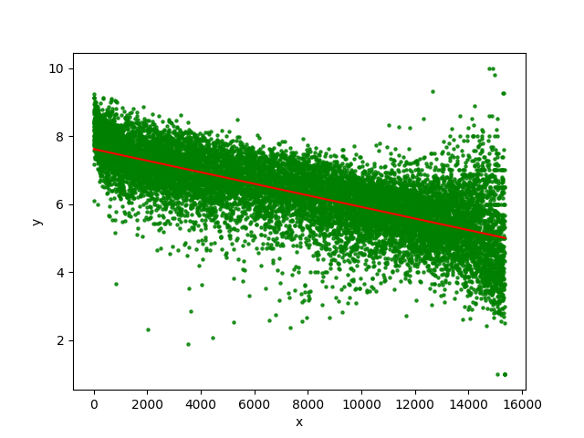

# Искуственный интелект

***

## [Первый датасет](https://www.kaggle.com/aludosan/myanimelist-anime-dataset-as-20190204)

***

**Score** - рейтинг, значение варьирующееся от 0 до 10. Для каждого аниме считается, как среднее значение, которое ставят пользователи.

**Popularity** - популярность, зависит от количества пользователей, которые добавили аниме себе в лист.

Построенные графики:
***

***

***

***

## [Второй датасет](https://bitly.com/a/404notfound)

***

На первом графике отражены самые популярные языки программирования замеченные в вапросах на stackoverflow в заголовках 

На втором те же языки, но только в текстах самих вопросов.

***

***

***

## Алгоритм K-means

Алгоритм достаточно прост и решает задачу кластеризации объектов

По заданным условиям и метрикам алгоритм распределяет объекты на кластеры таким образом, что бы объекты не принадлежащие одному кластеру максимально друг от друга отличались, а принадлежащие, наоборот, были похожи.

Для кластеризации текстовых данных воспользуемся [матрицей tfid](https://en.wikipedia.org/wiki/Tf%E2%80%93idf), она отражает похожесть единиц текста -  нашем случае заголовков запросов к **stackoverflow** в виде численных векторов.

cluster_id | * | * | * | * | * | * | * | * | * | * | * | * | * | * | * 
 --- | ---| ---| ---| ---| ---| ---| ---| ---| ---| ---| ---| ---| ---| ---| ---
0 | file | error | valu | java | python | string | c | creat | array | server | # | jqueri | set | list | imag | class
  | | | | | | | | | | | | | | | 
1 | function | call | jqueri | return | error | javascript | c | python | valu | variabl | c++ | paramet | pass | class | argument | data
  | | | | | | | | | | | | | | | 
2 | page | load | web | jqueri | html | php | asp | javascript | net | show | multipl | make | data | reload | scroll | error
  | | | | | | | | | | | | | | | 
3 | whi | doe | file | code | error | function | string | differ | loop | give | need | valu | result | call | method | class
  | | | | | | | | | | | | | | | 
4 | object | array | c | creat | json | valu | javascript | java | return | type | class | method | pass | attribut | list | properti
  | | | | | | | | | | | | | | | 
5 | data | json | tabl | file | column | sql | valu | store | read | databas | insert | return | core | set | frame | save
  | | | | | | | | | | | | | | | 
6 | android | app | studio | error | devic | file | imag | java | applic | activ | view | show | custom | screen | servic | class
  | | | | | | | | | | | | | | | 
7 | add | dynam | valu | list | jqueri | file | data | element | text | class | c | # | multipl | librari | function | field
  | | | | | | | | | | | | | | | 
8 | issu | jqueri | android | ie | creat | item | server | javascript | css | data | api | io | app | php | x | file
  | | | | | | | | | | | | | | | 
9 | button | click | radio | add | jqueri | chang | android | creat | event | display | submit | dynam | page | text | dialog | form
  | | | | | | | | | | | | | | | 
10 | user | input | api | login | access | control | make | email | current | asp | net | updat | time | data | set | id
  | | | | | | | | | | | | | | | 
11 | row | tabl | column | valu | mysql | sql | cell | select | updat | data | base | delet | one | multipl | count | differ
  | | | | | | | | | | | | | | | 
12 | chang | color | valu | file | jqueri | font | text | background | size | variabl | without | class | view | style | javascript | content
  | | | | | | | | | | | | | | | 
13 | url | redirect | rewrit | django | php | chang | jqueri | post | link | htaccess | queri | request | string | imag | page | paramet
  | | | | | | | | | | | | | | | 
14 | php | array | file | mysql | valu | variabl | function | error | html | queri | data | code | result | display | server | make
  | | | | | | | | | | | | | | | 
15 | select | text | file | valu | sql | box | field | list | tabl | multipl | element | string | display | column | line | input
  | | | | | | | | | | | | | | | 

Отчетливо видно, что подобная кластеризация имеет смысл и место. На мой взгляд результат очень неплохой.

Для жанров аниме из первого датасета так же были выделены кластеры из личного интереса, а результат, действительно занятный.

cluster_id | * | * | * | * 
 --- | ---| ---| ---| ---
0 | 'Sci-Fi' | 'Action' | 'Mecha' | 'Adventure' | 'Comedy'
  | | | | 
1 | 'Comedy' | 'Action' | 'Drama' | 'Shounen' | 'Romance'
  | | | | 
2 | 'Fantasy' | 'Adventure' | 'Comedy' | 'Kids' | 'Action'
  | | | | 
3 | 'Slice of Life' | 'Comedy' | 'School' | 'Drama' | 'Romance'
  | | | | 
4 | 'Comedy' | 'Parody' | 'School' | 'Adventure' | 'Ecchi'
  | | | | 
5 | 'Magic' | 'Fantasy' | 'Comedy' | 'Action' | 'Adventure'
  | | | | 
6 | 'Hentai' | 'School' | 'Supernatural' | 'Fantasy' | 'Demons'
  | | | | 
7 | 'Kids' | 'Comedy' | 'Adventure' | 'Drama' | 'Historical'
  | | | | 
8 | 'Music' | 'Kids' | 'Comedy' | 'Dementia' | 'Fantasy'
  | | | | 
  
  ## Полиномиальная регрессия

Данный алгоритм не раскрылся в полной мере и не стал таким интересным ввиду того, что данные не подходили для прогнозов и подобных оценок.

Оценка ошибки показала, `0.6282548088361429`, что нормально для таких данных. Они сплошной полосой разбросаны вдоль линии.
