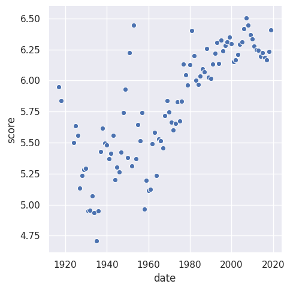

# Искуственный интелект

***

## [Первый датасет](https://www.kaggle.com/aludosan/myanimelist-anime-dataset-as-20190204)

***

**Score** - рейтинг, значение варьирующееся от 0 до 10. Для каждого аниме считается, как среднее значение, которое ставят пользователи.

**Popularity** - популярность, зависит от количества пользователей, которые добавили аниме себе в лист.

Построенные графики:
***

***

***

***

## [Второй датасет](https://bitly.com/a/404notfound)

***

На первом графике отражены самые популярные языки программирования замеченные в вапросах на stackoverflow в заголовках 

На втором те же языки, но только в текстах самих вопросов.

***

***

***
