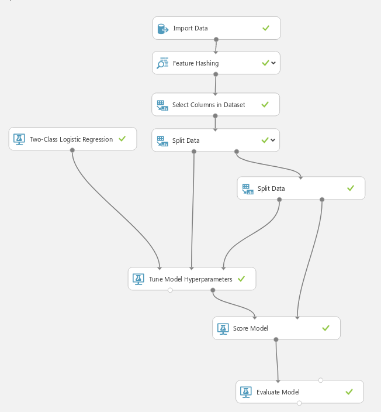
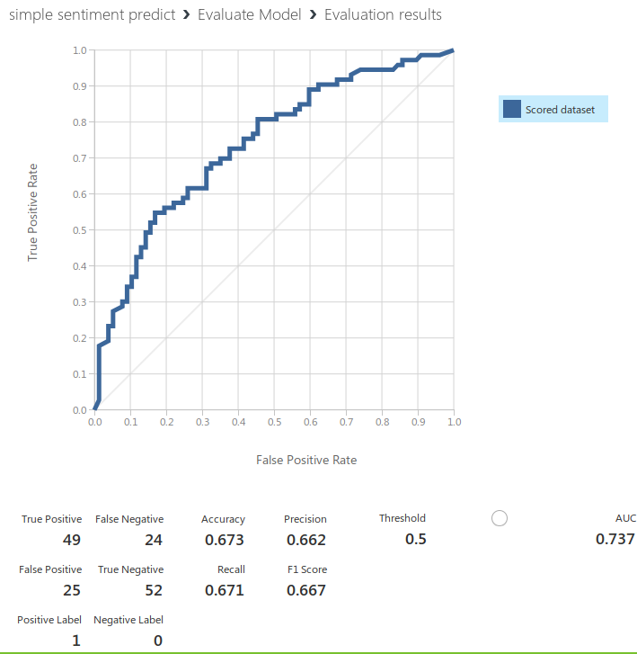

## Лабораторная работа 1

Ваша задача познакомиться с платформой Azure Machine Learning, реализовывав полный цикл разработки решения задачи машинного обучения.

Одной из распространенных учебных задач по классификации текста - оценка его настроения, положителен он или отрицателен.

Пример подобного датасета [здесь](https://raw.githubusercontent.com/laploy/ML.NET/master/Sentiment/yelp_labelled.txt)

Дальше, мы будем решать проблему бинарной классификации которая заключается в классификации элементов в один из двух классов 
(классификация элементов более чем в два класса называется мультиклассовой классификацией).

Решение
Чтобы решить эту проблему, сначала мы построим модель ML. Затем мы будем обучать модель на существующих данных оценивать, насколько она хороша.

Сама модель выглядит так:

Но интересны нам результаты работы:

В целом, не так плохо, однако, эта модель далеко не совершенна. В среде **microsoft azure** есть множество возможностей для обработки текстовых данных которыми я не воспользовался,
 так же можно встраивать скрипты на языках `Python` и `R`. Они облегчают обработку датасетов, позволяют получать более чистые данные.
